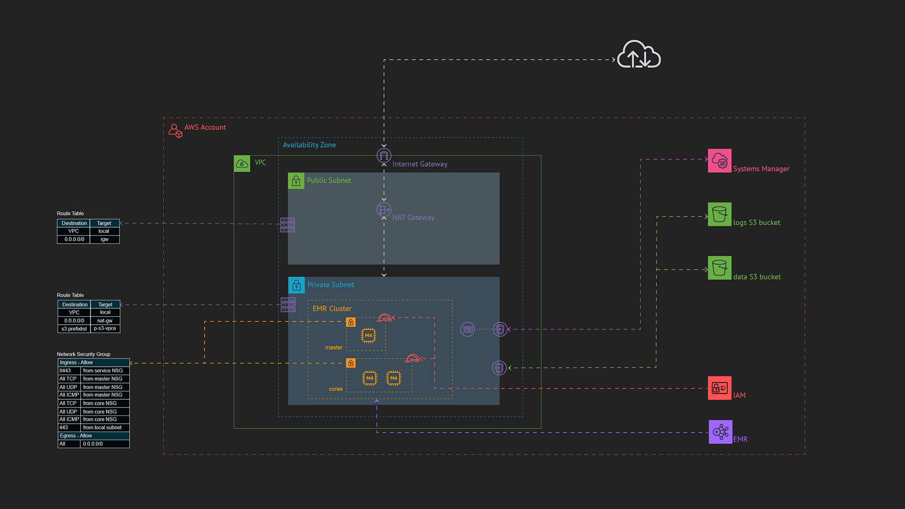

# Deploy a simple AWS EMR Spark cluster with AWS CDK

I am studying at the __School of Information at the University of Michigan__, in the online Master of Applied Data Science.
During the __SIADS 516 course Big Data: Scalable Data Processing__ course we studied Spark 
while I was also studying at the same time for the AWS Certification __Data Analytics Specialty__.
I thus decided to create a package with the AWS CDK to deploy my own AWS EMR Spark environment and try to run my homework
assignments on a full cluster instead of a single node.

## What does this code do?

It deploys a full test environment (VPC, S3 buckets, EMR cluster, etc.) and creates and run the Spark tasks (EMR steps)
defined in the `./emr_steps` folder. It also creates the Network Security Group and IAM role to create an EMR Notebook
(it does not create the notebook itself as there seem to be no CloudFormation resource to do that).

Despite it started with the MADS SIADS 516 course in mind, I tried to make this repository flexible 
so you can extend it to run your own Spark jobs.

The architecture diagram shows the components deployed in this stack:
* a dedicated VPC, with public and private subnets, internet and nat gateways
* the Network Security Groups for the cluster
* the S3 buckets for the Spark logs and the data (code, input data files and jobs outputs)
* IAM Roles for the cluster instances and EMR service
* the EMR cluster itself
* a VPC Endpoint for Systems Manager to access the instances if needed using Systems Manager instead of opening SSH ports
* a gateway VPC endpoint for the instances to access the S3 service directly
  
The stack also
* pushes the data and PySpark code to the data s3 bucket
* automatically creates the EMR steps to run your Spark jobs and outputs the results in the data S3 bucket 



### Why just one AZ ?

This stack deploys EMR __Instance Groups__ and not __Instance Fleets__ and Instance Groups can only be deployed in a single AZ.

### What type of instances are deployed ?

By default the stack deploys `m4.large` __SPOT__ instances as follow
* 1 master node
* 2 core nodes

You can change the instance type and number of core nodes using the parameters passed to the `AwsEmrSparkStack` object in the `app.py` file.

### Stack parameters

The stack is created in the `app.py` file by creating an `AwsEmrSparkStack` object. It accepts the following parameters.

| Parameter | Description | Optional | Default value |
|---|---|---|---|
| cider | The CIDR range of the VPC. It will be split in half to create both private and public subnets | Yes | 172.16.0.0/22 |
| max_azs | The number of AZ. However even if you set more than one, only the first one will be used to deploy the cluster | Yes | 1 |
| naming_prefix | A naming prefix attached to resources like S3 buckets | Yes | "default" |
| naming_suffix | A naming suffix attached to resources like S3 buckets | Yes | A random combination of 8 characters and numbers |
| instance_type | The instance type used by the master and core nodes | Yes | m4.large |
| instance_consumption | The instance consumption type. Can be SPOT or ON_DEMAND | Yes | SPOT |
| nb_core_instances | The number of core instances deployed | Yes | 2 |

Example in the `app.py` file:
```
emr_stack = AwsEmrSparkStack(
    scope=app,
    construct_id="AwsEmrSparkStack",
    naming_prefix="mads-siads-516")
```

## Prerequisites

To deploy this stack you must have:
* an AWS Account
* the [AWS CLI installed](https://docs.aws.amazon.com/cli/latest/userguide/install-cliv2.html)
* the [AWS CLI configured](https://docs.aws.amazon.com/cli/latest/userguide/cli-chap-configure.html) with an IAM user and access keys
* Python >= 3.6 installed
* the [AWS CDK installed](https://docs.aws.amazon.com/cdk/latest/guide/getting_started.html)

Other useful links:
* [The GitHub repository of the AWS CDK](https://github.com/aws/aws-cdk)

## How to deploy this stack?

The `cdk.json` file tells the CDK Toolkit how to execute your app.

This project is set up like a standard Python project.  The initialization
process also creates a virtualenv within this project, stored under the `.venv`
directory.  To create the virtualenv it assumes that there is a `python3`
(or `python` for Windows) executable in your path with access to the `venv`
package. If for any reason the automatic creation of the virtualenv fails,
you can create the virtualenv manually.

To manually create a virtualenv:

```
$ python -m venv .venv
```

After the init process completes and the virtualenv is created, you can use the following
step to activate your virtualenv.

```
$ source .venv/bin/activate
```

If you are a Windows platform, you can activate the virtualenv by just running the .BAT script:

```
% .source.bat
```

Once the virtualenv is activated, you can install the required dependencies.

```
$ pip install -r requirements.txt
```

At this point you can now synthesize the CloudFormation template for this code
to see the resources that the stack will create

```
$ cdk synth
```

To actually deploy the stack to your default AWS account and region.
* If you have several AWS profiles configured, add the option `--profile <profile name>`
* If you want to deploy in a different region use the option `--region <region name>`

```
$ cdk deploy
```


To add additional dependencies, for example other CDK libraries, just add
them to your `setup.py` file and rerun the `pip install -r requirements.txt`
command.

### Useful AWS CDK commands

 * `cdk ls`          list all stacks in the app
 * `cdk synth`       emits the synthesized CloudFormation template
 * `cdk deploy`      deploy this stack to your default AWS account/region
 * `cdk diff`        compare deployed stack with current state
 * `cdk docs`        open CDK documentation

## How to configure and run Spark jobs ?

The configuration and data for your Spark jobs must be created in the `./emr_steps` folder.
* the `./emr_steps/emr_steps_configuration.json` file contains a list of the configuration of your spark jobs
* the `./emr_steps/code` folder contains the Python code for your Spark jobs. One file per job.
* the `./emr_steps/data` folder contains the folders with the data required for your Spark jobs. One folder per job.

__Note:__

This stack will copy the code and data to the S3 data bucket in the corresponding `code/` and `data/` root folders. 
If your data are very large, another method would have to be used to transfer them
 and this stack would need to be modified.

### The Spark Jobs configuration

The Spark jobs to be run on the cluster are configures in the `./emr_steps/emr_steps_configuration.json` file.
It is a list of steps, each containing
* a `name` attribute
* a `code_filename` attribute indicating the Python file name in the `./emr_steps/code` folder
  containing the code for the job.
* a `data_source_folder` optional attribute indicating the folder in the `./emr_steps/data` folder
  containing the data for the job

Example:
```
{
  "steps": [
    {
      "name": "step1",
      "code_filename": "step1.py"
    },
    {
      "name": "step2",
      "code_filename": "step2.py",
      "data_source_folder": "step2"
    }
  ]
}
```

The example jobs in this stack are coming from:
* step1: The AWS documentation [Write a Spark application](https://docs.aws.amazon.com/emr/latest/ReleaseGuide/emr-spark-application.html)
* step2: An adaptation I made of some homework from the MADS program SIADS 516 course.
  It uses a text document of old New York Times articles.

### Bootstraping the EMR instances

If your Spark jobs requires special Python packages, they will need to be installed on the EMR instances.

To do so, the stack is configured to run a bootstrap shell script on the instances once they are started.
The shell script is configured in the `./ec2_bootstrap_scripts/bootstrap.sh` file.

## Spark jobs results and logs

### Accessing the Spark jobs results

The results of the Spark jobs are stored in the S3 __data__ bucket created by the stack 
in the `outputs/<job name>/` folder. The results are stored in parts. Each instance of the cluster outputing its
part of the results.

### Accessing the Spark logs

If anything goes wrong with your Spark job, you can look in the logs S3 bucket created in the stack.
There will be a folder for the cluster name. In it there should be 3 folders `containers/`, `node/` and `steps/`.

The EMR Spark step logs are in the `steps/application_XXXXXX_<job number>/<container name>/stdout.gz` file.

The Python code logs and errors are in the `containers/<job ID>/stderr.gz` file.

## How to delete this stack ?

```
$ cdk destroy
```

__Warning__:

Because they contain the Spark logs and outputs, the S3 buckets are retained by the stack (i.e. they are not destroyed).

You will have to manually empty and delete them once you are finished with the data they contain.

## To do
* Add outputs to the stack (e.g. the S3 buckets names, EMR cluster name, etc...)
* Add asserts on Spark job configuration and the parameters of the `AwsEmrSparkStack` object.
